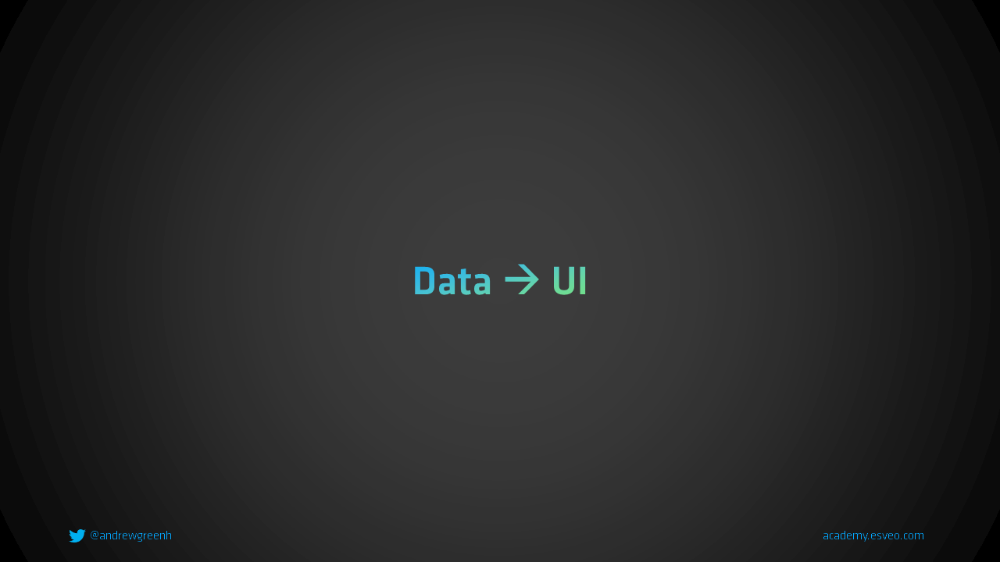

# Wie funktioniert React?



## Code

```tsx
// Daten über props
function App(props: { count: number }) {
  const nextValue = props.count + 1;

  return (
    <div>
      <p>Der aktuelle Wert ist: {props.count}</p>
      <p>Der nächste Wert ist: {nextValue}</p>
    </div>
  );
}

// In anderer Datei
const content = <App count={5} />;
```
