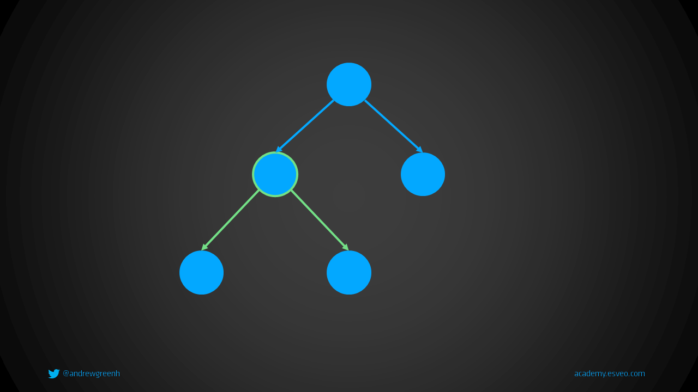

# Daten, die sich im Laufe der Zeit ändern: State




```tsx
import { useState } from "react";

export function App(props: { initialCount: number }) {
  const [count, setCount] = useState(props.initialCount);

  return <button onClick={() => setCount(count + 1)}>{count}</button>;
}
```
