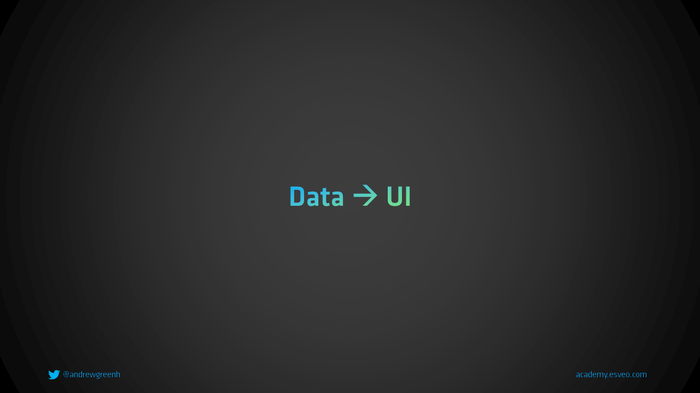

# Kommunikation mit der Außenwelt




## Updates in der Top-Down-Welt


## Auf render reagieren


## Code

```tsx
import { useState, useEffect } from "react";

export function UserList(props: { username: string }) {
  const [response, setResponse] = useState<GithubResponse | null>(null);

  useEffect(() => {
    loadJson<GithubResponse>(
      `https://api.github.com/search/users?q=${props.username}`
    ).then((response) => {
      setResponse(response);
    });
  }, [props.username]);

  return (
    <div>
      {response?.items.map((item) => (
        <div key={item.login}>{item.login}</div>
      ))}
    </div>
  );
}

async function loadJson<TResponse>(url: string) {
  const response = await fetch(url);
  const responseBody = await response.json();

  return responseBody as TResponse;
}
```
