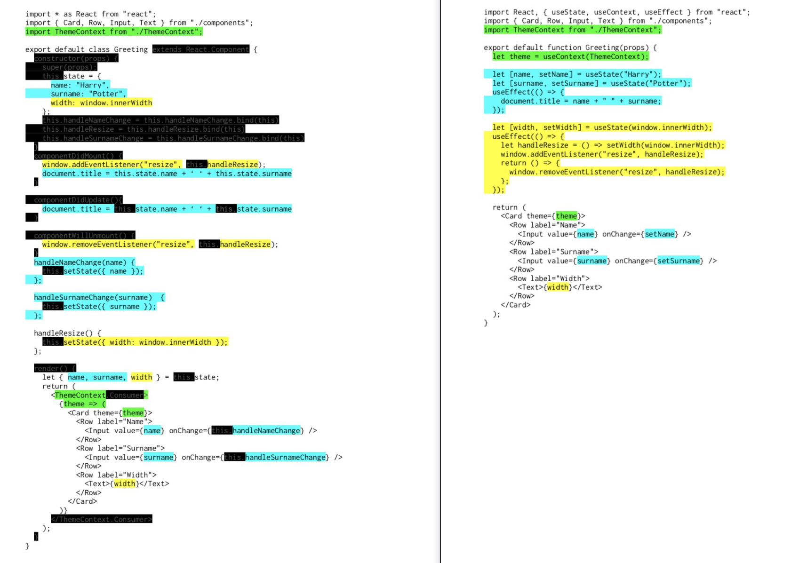

# Vorteile von Hooks

- Lassen sich hervorragend typisieren
- Es ist absolut klar, woher Variablen kommen
- Es können keine Namenskonflikte auftreten
- Resultate der einen Hook können Inputs der nächsten Hook sein.
- Fördern Colocation:

